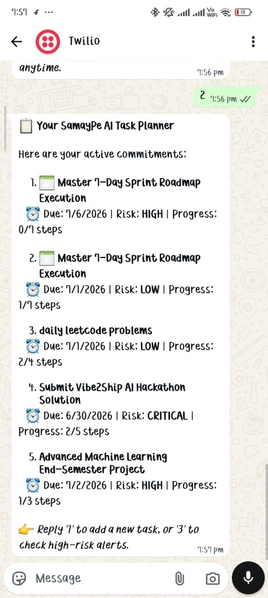
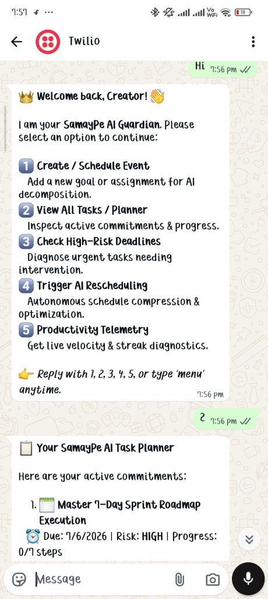

# ⛩️ SamayPe AI — Autonomous Deadline Guardian & Multi-Channel Intervention Engine

[](https://samaype-ai-339043112543.us-central1.run.app)
[](https://deepmind.google/technologies/gemini/)
[](https://nextjs.org)
[](https://www.twilio.com)

> **"Traditional calendars are passive archives of failure. SamayPe AI is an active guardian that compresses schedules, prevents burnout, and meets developers where they live—on web and WhatsApp."**

---

## 🌐 Live Production Demo & Judge Credentials

| Link / Role | Access URL / Credentials |
| :--- | :--- |
| **🌐 Live Production Web App** | **[https://samaype-ai-339043112543.us-central1.run.app](https://samaype-ai-339043112543.us-central1.run.app)** |
| **🏆 One-Click Judge Demo Login** | Click **"One-Click Judge Demo Login 🚀"** directly on the `/login` page |
| **🔑 Manual Demo Credentials** | Email: `judge@vibe2ship.ai` <br> Password: `vibe2ship2026` |
| **📱 WhatsApp Sandbox Companion** | Send **`menu`** to **`+1 415 523 8886`** *(Twilio Sandbox)* |

---

## 🔥 Executive Summary

Modern students and developers suffer from **Deadline Drift**—they overestimate future energy, create monolithic tasks, and ignore calendar reminders until panic sets in. 

**SamayPe AI** solves this by evaluating human commitments across **4 Cognitive Domains**:
1. **Urgency Load** (Time remaining curve)
2. **Impact Score** (Weight on overall GPA/career/project success)
3. **Cognitive Energy Demand** (High focus vs. low effort administrative work)
4. **Streak Velocity** (Historic momentum and execution rate)

Powered by **Google Gemini 2.5 Flash**, SamayPe AI acts as an autonomous co-pilot that decomposes massive goals into bite-sized roadmaps, continuously evaluates risk levels, and provides bi-directional interventions directly over WhatsApp.

---

## 📱 Bi-Directional Multi-Channel WhatsApp Intervention Engine

SamayPe AI doesn't wait for you to log into a dashboard. It maintains an active, bi-directional webhook link via **Twilio WhatsApp** that lets you manage your entire schedule on the go.

### 📸 Live WhatsApp Interactive Companion in Action

<div align="center">
  
  &nbsp;&nbsp;&nbsp;&nbsp;
  
</div>

### 🎯 Core WhatsApp Bot Capabilities:

1. **👑 Interactive Multi-Option Menu (`Option 1 to 5`)**
   - Whenever you text `menu`, `hi`, or `hello`, the bot greets you with a clean numbered menu so you never have to memorize commands.
2. **📝 Option 1: Create & Schedule Goal with AI Decomposition**
   - Reply `1` and tell the bot: *"I have a hackathon submission due tomorrow evening."*
   - Gemini 2.5 intercepts your message, calculates realistic risk, extracts due dates, and builds a 5-step subtask checklist saved directly to your cloud dashboard.
3. **📋 Option 2: View Active Task Planner (`Stack of Tasks`)**
   - Reply `2` to receive your clean formatted daily planner with live progress trackers (`[2/4 steps completed]`) and real-time AI risk badges (`CRITICAL`, `HIGH`, `LOW`).
4. **🚨 Option 3: Diagnose High-Risk Deadlines**
   - Reply `3` to isolate only the tasks in immediate danger of failing, accompanied by Gemini recommendations on what to cut or delegate.
5. **⚡ Option 4: Trigger Autonomous Schedule Compression**
   - Reply `4` when feeling overwhelmed. Gemini re-balances your schedule, pushes non-critical tasks forward, and compresses milestones into achievable 25-minute sprints.
6. **✏️ Option 5 & Self-Service Controls: Rename & Delete**
   - Users can rename any task on the fly or delete completed/obsolete tasks right from their chat interface.

---

## ⚡ Core Functional & AI Features Summary

* **🧠 Autonomous Goal Decomposition (Gemini 2.5):** Transforms high-level goals into estimated, bite-sized subtask checklists automatically upon creation.
* **📱 Bi-Directional WhatsApp Companion Engine:** Full schedule control via Twilio webhooks—add tasks, check daily planners, diagnose urgent risks, and trigger AI auto-fixes directly over WhatsApp.
* **🛡️ Proactive Auto-Fix Rescheduling:** Detects deadline drift and overloaded schedules, autonomously compressing and realigning tasks to feasible time slots with a single click.
* **📊 Multi-Domain Priority Ranking:** Synthesizes time urgency, career/GPA impact, energy load, and streak velocity to dynamically rank and prioritize commitments in real time.
* **🩺 Live Burnout & Velocity Diagnostics:** Tracks execution momentum and cognitive load distribution to alert users and suggest workload reductions before burnout occurs.
* **🎙️ Multi-Channel Management Controls:** Rename, delete, complete subtasks, or reschedule commitments seamlessly across both the web application and phone interface.

---

## 🛠️ Technology Stack & System Architecture

| Layer | Technology | Purpose |
| :--- | :--- | :--- |
| **Frontend Framework** | Next.js 15 (App Router) | Server-Side Rendering, API Routes, & Client Components |
| **AI / LLM Engine** | Google Gemini 2.5 Flash (`@google/genai`) | Cognitive Decomposition, Risk Drift Analysis, & NLP |
| **Messaging Engine** | Twilio SDK & WhatsApp Webhooks | Bi-directional interactive chat & reminder alerts |
| **Styling & UI** | Tailwind CSS & Framer Motion | Cyber mecha glassmorphism & fluid HUD animations |
| **Cloud Infrastructure** | Google Cloud Run (Docker Containerized) | Auto-scaling serverless production container |

---

## 🚀 Local Development Setup

### Prerequisites
* Node.js 18+ installed
* A Gemini API Key from Google AI Studio
* Twilio Account SID & Auth Token (for WhatsApp features)

### Installation Steps

1. **Clone the Repository:**
   ```bash
   git clone https://github.com/KRIWAL21/SamayPe.AI.git
   cd SamayPe.AI
   ```

2. **Install Dependencies:**
   ```bash
   npm install
   ```

3. **Configure Environment Variables:**
   Create a `.env.local` file in the project root:
   ```env
   GEMINI_API_KEY=your_gemini_api_key_here
   TWILIO_ACCOUNT_SID=your_twilio_sid
   TWILIO_AUTH_TOKEN=your_twilio_auth_token
   TWILIO_WHATSAPP_FROM=whatsapp:+14155238886
   USER_WHATSAPP_NUMBER=whatsapp:+91yourphonenumber
   ```

4. **Run the Development Server:**
   ```bash
   npm run dev
   ```
   Open [http://localhost:3000](http://localhost:3000) to view the application.

---

## 🏆 Hackathon Alignment & Impact

SamayPe AI proves that AI coding assistants and autonomous models can do far more than generate code—they can actively manage human bandwidth, protect mental well-being, and act as personalized productivity guardians across web and mobile platforms.

---
*Built with ❤️ and autonomous precision for the Vibe2Ship AI Hackathon 2026.*
